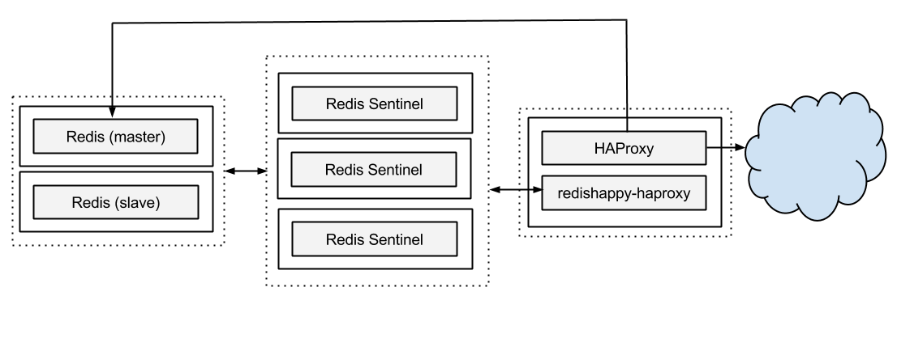
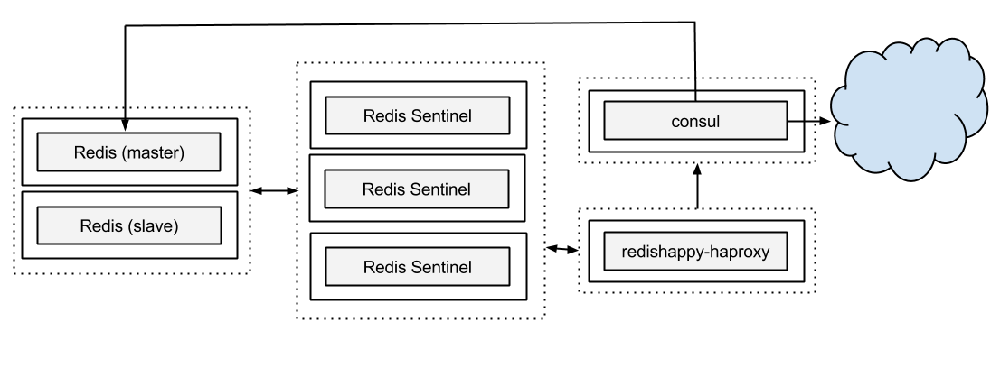

### redishappy

[](https://travis-ci.org/mdevilliers/redishappy)
[](https://coveralls.io/r/mdevilliers/redishappy)

One method of providing a highly available Redis service is to deploy using [Redis Sentinel](http://redis.io/topics/sentinel).

Redis Sentinel monitors your Redis cluster and on detecting failure, promotes a slave to become the new master. RedisHappy provides a daemon to monitor for this promotion and to tell the outside world that this has happened.

Currently we support [HAProxy](http://www.haproxy.org/) and [Consul](https://www.consul.io/).

Features

* Automatic discovery and healthchecking of Redis Sentinels.
* Extensible to support various service discovery mechanisims
* Developed in Golang, clean deployment with no additional dependencies.
* Read-only RestAPI.
* Syslog integration.


### FAQ

Q. Why - I thought in 2014 Redis clients should be Sentinel aware? They should connect to the correct Redis instance on failover.

A. Some do, some don't. Some it seems to be an eternal 'work in progress'. Rather than fixing all of the clients we needed to work correctly with Sentinel, RedisHappy was built upon the fact that all of the clients I have tested are great at connecting to a single address. 

Q. Why - This [article](http://blog.haproxy.com/2014/01/02/haproxy-advanced-redis-health-check/) suggests that HAProxy can healthcheck Redis instances quite fine by itself. 

A. Yes. It can do. But not reliably... I'll explain. 

Suppose we have this setup. R1 and R2 are redis instances, S1,S2,S3 are Sentinel instances, H1 and H2 are HAProxy instances. 

<pre>
	R1,R2
	S1, S2, S3
	H1, H2
</pre>

- Life is good - R1 and R2 are in a master slave configuration, H1 and H2 correctly identify R1 as the master

<pre>
	R1      R2
	M  ---- S
    ^
    |
    ---------
    |       |
	H1      H2
</pre>

- Disaster! - R1 dies or is partitioned but don't fear R2 is now the "master". Day saved! 

<pre>
	*       R2
			M
    		^
            |
    ---------
    |       |
	H1      H2
</pre>

- Disaster! - R1 comes back online and announces itself as a "master". Both R1 and R2 are now accepting writes, as HAProxy's healthcheck identifies both as online.

<pre>
	R1		R2
	M       M
    ^		^
    |       |
    ---------
    |       |       
	H1      H2
</pre>

- R1 is made the "slave" of R2. Everything is ok now, except for the writes that R1 accepted which are lost forever.

<pre>
	R1      R2
	S ----- M
    		^
            |
    ---------
    |       |
	H1      H2
</pre>

When a Redis instance is started and stopped it initially announces itself as a "master". It will some time later be made a "slave" but in the meantime accept writes which will be lost when it is correctly made a slave.

RedisHappy attempts to avoid this failure mode by only presenting the correct server to HAProxy or any other service once it is confirmed as a "master". We assume clients will either block or fail until the master is online again.

### Deployment

Deploying redishappy_haproxy



Deploying redishappy_consul



### Building

Download and build

```
go get github.com/mdevilliers/redishappy

cd $GOPATH/src/github.com/redishappy

build/ci.sh
build/release.sh
```

ci.sh - builds the code, runs the tests
release.sh - builds the deb packages

Using vagrant

```
vagrant up
```

The packages are then at - $GOPATH/src/github.com/redishappy/build

The vagrant box also installs HAProxy for smoke testing.


### Defaults

Installs to /opt/redishappy

Configuration to /var/redishappy

Logs to file in /var/redishappy/logs

Warnings, Errors got to syslog

### Configuration

Example configurations can be found in the main folders

[HAProxy](main/redis-haproxy)

[Consul](main/redis-consul)

Definitions for the elements

```Javascript
{
  // REQUIRED - needs to contain at least one logical cluster
  "Clusters" :[
  {
    "Name" : "testing", // logical name of Redis cluster
    "ExternalPort" : 6379 // port to expose for the cluster via HAProxy
  }],
  // REQUIRED - needs to contain the details of at least one cluster
  // redishappy will discover additional sentinels as they come online
  "Sentinels" : [ 
      {"Host" : "172.17.42.1", "Port" : 26377}
  ],
  // OPTIONAL for running redishappy-haproxy
  "HAProxy" :
    {
      // REQUIRED - absolute path to the template file
      "TemplatePath": "/var/redishappy/haproxy_template.cfg",
      // REQUIRED - absolute path to HAProxy's config file
      "OutputPath": "/etc/haproxy/haproxy.cfg",
      // REQUIRED - command to run to reload the config file on changes
      "ReloadCommand": "haproxy -f /etc/haproxy/haproxy.cfg -p /var/run/haproxy.pid -sf $(cat /var/run/haproxy.pid)"
    },
    // OPTIONAL for running redishappy-consul
   "Consul" : {
   	// REQUIRED - path to Consul instance
    "Address" : "127.0.0.1:8500",
    // REQUIRED - for each cluster in the main config there should be a defined service
  	"Services" : [
		{ 
			// REQUIRED - should match a name of a Cluster in the main config
			"Cluster" : "testing", 
			// REQUIRED - logical name for the node
        	"Node" : "redis-1",
        	// REQUIRED - logical name for the data centre
        	"Datacenter": "dc1",
        	// REQUIRED - tags for the service
        	"tags" : [ "redis", "master", "anothertag"]
      	}
  	]
  }
}

```


### Api

RedisHappy provides a readonly api on port 8000

GET /api/ping - will reply "pong" if running

GET /api/configuration - displays the start up configuration

GET /api/sentinels - displays the sentinels being currently monitored and their current states

GET /api/topology - displays the current view of the Redis clusters, their master and their host/ip addresses


### Hacking

Running the following script will gofmt, govet, rune the tests, build all of the executables.

```
build/ci_script.sh

```

### Testing with Docker

https://github.com/mdevilliers/docker-rediscluster

Will start up a master/slave, 3 sentinel redis cluster for testing.

### Logging

By default -

Trace - stdout
Info - stdout
Warning - syslog, file, stdout
Error - syslog, file, stdout

The log path is configurable.

Copyright and license
---------------------

Code and documentation copyright 2014 Mark deVilliers. Code released under the Apache 2.0 license.
